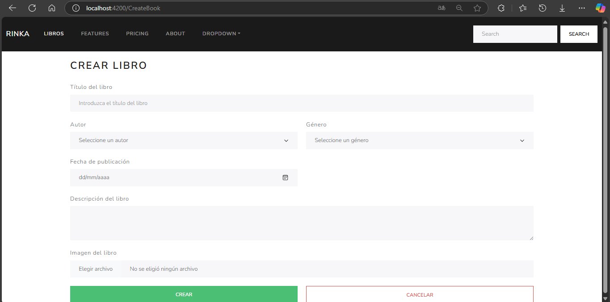
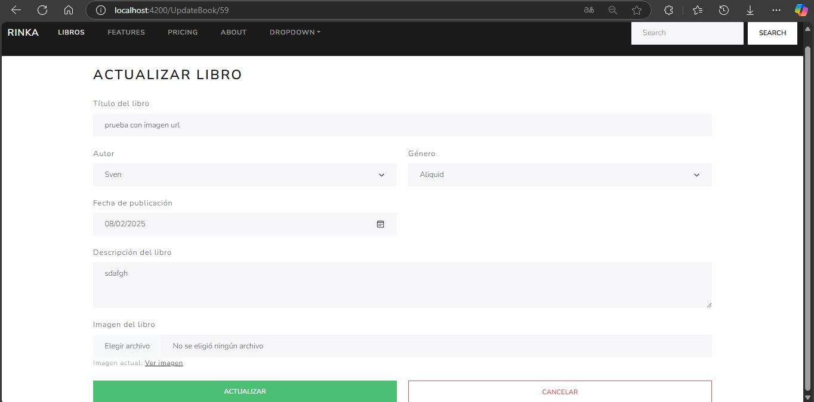
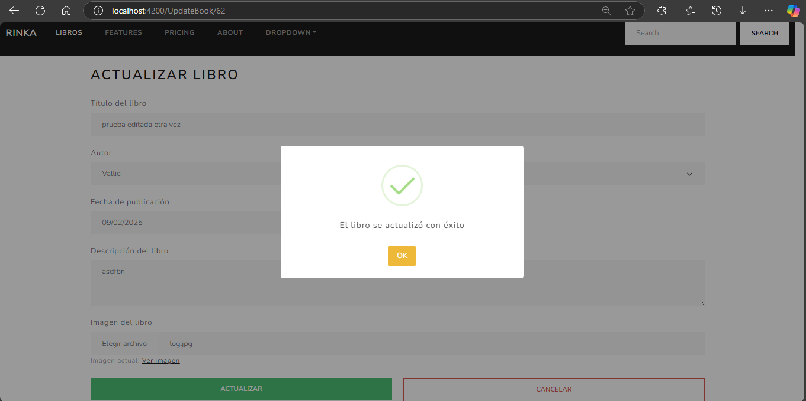

# front-end-angular-libros
front-end hecho en angular para usar con el back de laravel

### Index de libros 

### Formulario para crear libro

### Formulario para actualizar libro

### Mensaje de success

